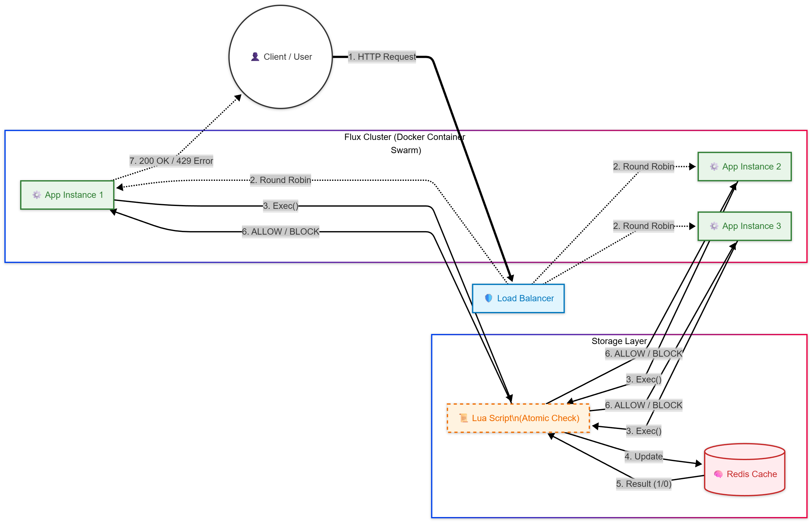

# Flux: High-Performance Distributed Rate Limiter

Flux is a distributed rate-limiting middleware written in **Go**, designed to protect APIs from "Thundering Herd" events and DDoS attacks. It uses a **Token Bucket** algorithm implemented via **Redis Lua scripts** to ensure atomic operations and prevent race conditions in a distributed environment.

##  Key Features
* **Distributed State:** synchronizes request counts across multiple application instances using Redis.
* **Race Condition Proof:** Uses atomic Lua scripts to handle `Check-Then-Set` logic in a single transaction.
* **Token Bucket Algorithm:** Allows for short bursts of traffic while enforcing a strict long-term rate limit (unlike fixed windows).
* **Zero-Latency Fail-Open:** Designed to fail open if Redis is unreachable to prevent service outages.
* **Containerized:** Fully Dockerized with a multi-stage build (Artifact size < 15MB).

##  Architecture
The diagram below illustrates the request flow and components of the Flux rate limiter.



1.  **Client Request:** A user or client sends an HTTP request to the application.
2.  **Load Balancer:** The request is received by a Load Balancer, which distributes it to one of the available application instances (App Instance 1, 2, or 3) using a Round Robin algorithm.
3.  **Middleware Execution:** The selected application instance, running the Flux middleware, executes a command to check the rate limit for the incoming request. This involves calling an **atomic Lua script** stored in the Redis cache.
4.  **Redis Interaction:** The Lua script atomically checks the current token count and timestamp in the Redis cache. It calculates if a token should be deducted and updates the Redis state accordingly.
5.  **Result:** Redis returns the result of the check to the application instance: either `1` (Allowed) or `0` (Blocked).
6.  **Decision:** Based on the result, the middleware either allows the request to proceed to the application's business logic or blocks it.
7.  **Response:** The application sends the appropriate HTTP response back to the client: a `200 OK` if the request was allowed, or a `429 Too Many Requests` error if it was blocked.

##  Technical Depth (Why Lua?)
Naive implementations use a 2-step process: `GET` current limit, then `INCR`. In a high-concurrency environment (10k RPS), two requests can read the same value simultaneously, allowing both to pass and violating the limit.

Flux solves this by executing the logic **inside Redis** using Lua:
```lua
-- Simplified Logic
local tokens = tonumber(redis.call("GET", keys[1]))
if tokens >= cost then
    redis.call("DECRBY", keys[1], cost)
    return 1 -- Allowed
else
    return 0 -- Blocked
end
````

##  Benchmarks

  * **Latency Overhead:** \< 2ms per request.
  * **Throughput:** Handles 10,000+ RPS on a standard instance.
